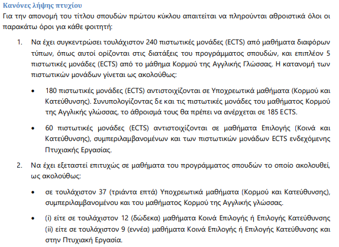

# ΟΔΗΓΙΕΣ ΟΡΚΩΜΟΣΙΑΣ

## Κανόνας λήψης πτυχίου

Σύμφωνα με τον [κανονισμό σουδών 2022](https://www.uom.gr/assets/site/public/nodes/4317/14235-KANONISMOS_SPOUDON_TMIMA_EP-EKDOSI_2022.pdf) στην σελίδα 7, αναφέρει:

Με λίγα λόγια θέλει 245 ECTS.

## Διαδικασίες λήψης πτυχίου

Αρχικά πρέπει να περιμένετε ένα μήνυμα από την γραμματεία.

1. Πρέπει να συμπληρώσετε την [Υπεύθυνη δήλωση αδυναμίας επιστροφής αποδεικτικών φοιτητικής ιδιότητας](https://www.uom.gr/assets/site/public/nodes/3661/7285-GradDeclaration.docx) (θα την βρείτε και στο αποθετήριο). Εδώ ουσιαστικά συμπληρώνετε ότι δεν έχετε παραλάβει το βιβλιάριο σπουδών και βιβλιάριο υγείας. Επίσης ανάλογα εάν δεν έχετε κάρτα σίτισης, το συμπληρώνετε και αυτό.    
2. Πρέπει να συμπληρώσετε την [Αίτηση συμμετοχής στην τελετή αποφοίτησης](https://www.uom.gr/assets/site/public/nodes/3661/7609-GradApplication_2020.docx) (θα την βρείτε και στο αποθετήριο). Εδώ ουσιαστικά αναφέρει και τα σημαντικά δικαιολογητικά που πρέπει να υποβάλετε. Συγκεκριμένα αναφέρει:

Καταθέτω τα παρακάτω δικαιολογητικά, ενώ για όσα δικαιολογητικά δεν κατέχω υποβάλλω υπεύθυνη δήλωση περί απώλειας ή μη παραλαβής τους. Τέλος, δηλώνω ότι δεν είμαι υπόχρεος/η απέναντι στον ΕΥΔΟΞΟ και τη Βιβλιοθήκη και εάν επιθυμώ την έκδοση του πτυχίου μου σε μεμβράνη:

* Βιβλιάριο Σπουδών.   
* Ακαδημαϊκή Ταυτότητα (Πάσο).   
* Βιβλιάριο Υγειονομικής Περίθαλψης (αν εκδόθηκε από το Τμήμα Φοιτητικής Μέριμνας).   
* Κάρτα Σίτισης.   
* Υπεύθυνη Δήλωση του Ν. 1599/1986 περί απώλειας ή μη παραλαβής των παραπάνω δικαιολογητικών στη διάρκεια των σπουδών μου.   
* Επιθυμώ την έκδοση του πτυχίου μου σε μεμβράνη   

Επιπλέον δηλώνω ότι έχω υποβάλει Ηλεκτρονική Αίτηση  [Ελέγχου εκκρεμοτήτων με ΕΥΔΟΞΟ και Βιβλιοθήκη](https://www.lib.uom.gr/index.php/el/aitisi-elegxou-mi-ekkremotitas?view=form) , γνωρίζοντας ότι η υποβολή της είναι υποχρεωτική και ότι η σχετική βεβαίωση εκδίδεται ενδοϋπηρεσιακά.
 
Θα συμπληρώσετε το τετραγωνάκι δίπλα στα κάθε δικαιολογητικό. Στο τέλος της πρώτης σελίδας αναφέρει:

**ΑΝΤΙΓΡΑΦΟ ΠΤΥΧΙΟΥ** 

Κάθε πτυχιούχος παραλαμβάνει αυτοπροσώπως την ημέρα ορκωμοσίας **ένα αντίγραφο πτυχίου (για κάθε χρήση στην Ελλάδα)** και το **αντίστοιχο Παράρτημα Διπλώματος**.

Ο πτυχιούχος έχει τη δυνατότητα, μετά την ορκωμοσία, να υποβάλει αίτηση για να παραλάβει <u>αντίγραφο πτυχίου για αρχές αλλοδαπής</u> και το αντίστοιχο <u>Diploma Supplement</u>, τα οποία υπογράφονται από τον εκάστοτε αρμόδιο υπάλληλο ή Αντιπρύτανη. Το αντίγραφο πτυχίου για αρχές αλλοδαπής θα πρέπει να μεταφραστεί σε επίσημο μεταφραστικό γραφείο (αφού προηγουμένως σφραγιστεί με τη Σφραγίδα της Χάγης, αν προορίζεται για χώρα που έχει προσχωρήσει στη Σύμβαση της Χάγης), ενώ το Diploma Supplement εκδίδεται ήδη στην αγγλική γλώσσα.

**ΕΚΔΟΣΗ ΠΤΥΧΙΟΥ ΣΕ ΜΕΜΒΡΑΝΗ (ΠΡΟΑΙΡΕΤΙΚΑ)**

Για την έκδοση του πτυχίου σε μεμβράνη, θα πρέπει να κατατεθεί στην ΤΡΑΠΕΖΑ ΠΕΙΡΑΙΩΣ το ποσό των 18 ευρώ (αρ. Λογαριασμού 5202-070107-503 & ΙΒΑΝ  GR81 0172 2020 0052 0207 0107 503) και να αποσταλεί ηλεκτρονικά ή ταχυδρομικά το καταθετήριο στη Γραμματεία, <u>μαζί με την κατάθεση των λοιπών δικαιολογητικών</u>. Για την παραλαβή της μεμβράνης οι πτυχιούχοι ενημερώνονται μέσω ανακοίνωσης στην [ιστοσελίδα όλων των ανακοινώσεων του Τμήματος](https://www.uom.gr/dai/ta-nea-toy-tmhmatos).

Η αίτηση είναι 2 σελίδες. Συμπληρώστε και τη 2η με τον τίτλο πτυχιακής, στοιχεία πρακτικής άσκησης καθώς και ERASMUS. Ουσιαστικά αυτά θα μπουν στο Diploma Supplement.

Στο τέλος αυτής της σελίδας αναφέρονται:

**ΔΗΛΩΣΗ ΣΥΜΜΕΤΟΧΗΣ ΣΕ ΕΚΠΑΙΔΕΥΤΙΚΟ ΠΡΟΓΡΑΜΜΑ ΤΗΣ ΒΙΒΛΙΟΘΗΚΗΣ**
Έχω συμμετάσχει σε 4 (τέσσερις) τουλάχιστον θεματικές ενότητες του Εκπαιδευτικού Προγράμματος της Βιβλιοθήκης **«ΠΛΗΡΟΦΟΡΙΑΚΗ ΠΑΙΔΕΙΑ»** εξαιρουμένης της πρώτης θεματικής ενότητας (LIB1) με τίτλο «Προσανατολισμός στο χώρο της Βιβλιοθήκης»   

**ΔΗΛΩΣΗ ΣΥΜΜΕΤΟΧΗΣ ΣΕ ΕΚΠΑΙΔΕΥΤΙΚΟ ΠΡΟΓΡΑΜΜΑ ΤΟΥ ΓΡΑΦΕΙΟΥ ΔΙΑΣΥΝΔΕΣΗΣ**
Έχω συμμετάσχει σε έξι (6) τουλάχιστον Θεματικές Ενότητες (σύνολο 24 ώρες) των Σεμιναρίων του Γραφείου Διασύνδεσης **“Εκπαίδευση στην Ανάπτυξη και Διαχείριση Δεξιοτήτων Σταδιοδρομίας”**. ΑΠΑΙΤΕΙΤΑΙ Η ΠΡΟΣΚΟΜΙΣΗ ΑΝΤΙΓΡΑΦΩΝ ΤΩΝ ΣΧΕΤΙΚΩΝ ΒΕΒΑΙΩΣΕΩΝ.   

<u>Το εκπαιδευτικό πρόγραμμα της βιβλιοθήκης πηγαίνει αυτόματα ενώ για του γραφείου διασύνδεσης πρέπει να στείλετε τις βεβαιώσεις.</u>

Θυμηθείτε να κρατήσετε αντίγραφο ασφαλείας του Google Drive σας καθώς και των μηνυμάτων στο mail σας (εκεί θα υπάρχουν αποθηκευμένες οι βεβαιώσεις).

ΜΗΝ ΞΕΧΑΣΕΤΕ ΝΑ ΖΗΤΗΣΕΤΕ ΤΗΝ ΒΕΒΑΙΩΣΗ [ΠΑΙΔΑΓΩΓΙΚΗΣ ΔΙΔΑΚΤΙΚΗΣ ΕΠΑΡΚΕΙΑΣ](https://www.uom.gr/dai/programma-paidagogikhs-kai-didaktikhs-eparkeias). ΕΑΝ ΕΧΕΤΕ ΤΕΛΕΙΩΣΕΙ ΤΑ ΜΑΘΗΜΑΤΑ ΚΑΙ ΕΧΕΤΕ ΑΚΟΜΑ ΠΡΟΣΒΑΣΗ ΣΤΟ [SIS-PORTAL](https://sis-portal.uom.gr/) ΜΠΟΡΕΙΤΕ ΝΑ ΖΗΤΗΣΕΤΕ.

## Επαγγελματικά δικαιώματα

Σύμφωνα με τον οδηγό [σπουδών 2023-2024](https://drive.google.com/file/d/1UTjhWPKKxKA_x0q9BpdRuZEFUWgQfYhU/view), υπάρχει 

Στην σελίδα 22 αναφέρει:

## Επαγγελματικά Δικαιώματα και Προοπτικές
Τα επαγγελματικά δικαιώματα των αποφοίτων του Τμήματος περιγράφονται στο σχετικό Προεδρικό Διάταγμα που δημοσιεύτηκε στο **ΦΕΚ A'/58/8.4.2009**. Οι απόφοιτοι και των δύο κατευθύνσεων του Τμήματος έχουν δικαίωμα εγγραφής στο Οικονομικό Επιμελητήριο. Ειδικότερα, οι απόφοιτοι του Τμήματος μπορούν να εργαστούν ως ελεύθεροι επαγγελματίες και στελέχη ιδιωτικών επιχειρήσεων, εκπαιδευτικοί στη δημόσια και ιδιωτική εκπαίδευση και ως στελέχη του δημόσιου τομέα.

### Ελεύθεροι επαγγελματίες και στελέχη ιδιωτικών επιχειρήσεων 
Διαθέτοντας τεχνικές γνώσεις σε συνδυασμό με δεξιότητες σε θέματα διοίκησης και επιχειρηματικότητας, οι απόφοιτοι του Τμήματος έχουν τις καλύτερες προϋποθέσεις για να πραγματοποιήσουν δικές τους επιχειρηματικές δραστηριότητες. Επιπλέον, ο παραπάνω συνδυασμός γνώσεων καθιστά τους αποφοίτους του Τμήματος ιδανικούς υποψηφίους για τη στελέχωση επιχειρήσεων σε διοικητικό επίπεδο, όπου η ύπαρξη ατόμων με ειδικές γνώσεις στις τεχνολογίες της πληροφορικής και των επικοινωνιών είναι σήμερα επιβεβλημένη περισσότερο από ποτέ. Οι απόφοιτοι του Τμήματος είναι ιδανικοί υποψήφιοι για θέσεις σε ένα ευρύ φάσμα επιχειρήσεων που περιλαμβάνει τις παραδοσιακές εταιρείες προϊόντων και υπηρεσιών/τεχνολογιών πληροφορικής και επικοινωνιών, εταιρείες υψηλής τεχνολογίας, καθώς και εταιρείες που δραστηριοποιούνται σε τομείς όπως ο τραπεζικός, ο ασφαλιστικός, ο ιατρικός τομέας, τα ΜΜΕ, οι εταιρείες παραγωγής και επεξεργασίας οπτικοακουστικού υλικού, η ναυτιλία, ο τουρισμός, καθώς και εταιρείες συμβούλων επιχειρήσεων.

### Εκπαιδευτικοί στη δημόσια και ιδιωτική εκπαίδευση
Όσον αφορά την Πρωτοβάθμια και Δευτεροβάθμια Εκπαίδευση, απαιτείται επιτυχής συμμετοχή των αποφοίτων του Τμήματος Εφαρμοσμένης Πληροφορικής σε διαγωνισμό του ΑΣΕΠ για τον κλάδο ΠΕ19, με στόχο τη συμμετοχή τους στους καταρτιζόμενους πίνακες διοριστέων εκπαιδευτικών λειτουργών της Δημόσιας Εκπαίδευσης. Στους πίνακες των κλάδων και ειδικοτήτων γίνεται ρητή αναφορά και στις δυο (2) προσφερόμενες κατευθύνσεις του Τμήματος.

### Στελέχη του δημόσιου τομέα
Οι πτυχιούχοι του Τμήματος (και για τις δύο κατευθύνσεις) μπορούν να συμμετέχουν σε προκηρύξεις (διαγωνισμούς) του Δημοσίου, μέσω ΑΣΕΠ, με γραπτό διαγωνισμό ή με σειρά προτεραιότητας για την προσφορά υπηρεσιών σε οργανικές μονάδες πληροφορικής, δικτύων, μηχανοργάνωσης και τεχνικών υπηρεσιών υπουργείων και δημοσίων οργανισμών για τον κλάδο ΠΕ Πληροφορικής (ΠΔ58/2009, άρθρο 3). Τα προσόντα διορισμού σε θέσεις φορέων του δημοσίου τομέα καθορίζονται από το ΠΔ50/2001 και ΠΔ347/2003 για θέσεις μόνιμου προσωπικού ή με σχέση εργασίας ιδιωτικού δικαίου. Συγκεκριμένα, για τον κλάδο της ΠΕ Πληροφορικής, τα προσόντα αναφέρονται στο άρθρο 6 του ΠΔ50/2001 (Κωδικοποίηση Προσοντολογίου για διορισμό στο Δημόσιο-Υπουργείο Διοικητικής Μεταρρύθμισης Π.Δ. 50/2001 (ΦΕΚ 39Α ́), όπως τροποποιήθηκε και συμπληρώθηκε με τα ΠΔ347/2003 (315Α ́), 44/2005 (63Α ́), 116/2006 (115Α ́) και 146/2007 (185Α ́), καθώς και με τους Ν.4115/2013 (24Α ́) και 4148/2013 (99Α ́).
