# MEGA Σκονάκι MySQL

### **Δημιουργία ΒΔ (CREATE DATABASE)**

Δημιουργεί μία καινούργια ΒΔ με όνομα το όνομα_ΒΔ.

```
CREATE DATABASE όνομα_ΒΔ
```

### **Διαγραφή ΒΔ (DROP DATABASE)**

Διαγράφει τη ΒΔ με όνομα το όνομα_ΒΔ.

```
DROP DATABASE όνομα_ΒΔ
```

### **Δημιουργία πίνακα (CREATE TABLE)**

Δημιουργεί ένα καινούργιο πίνακα με όνομα το όνομα_πίνακα.

```
CREATE TABLE όνομα_πίνακα (
όνομα_πεδίου τύπος_πεδίου επιπλέον_επιλογές,
....,
[περιορισμοί],
....
)
```
όπου οι επιπλέον_επιλογές και οι περιορισμοί είναι προαιρετικά, ενώ μπορεί να έχουμε πολλαπλές δηλώσεις πεδίων και περιορισμών.

## **Πεδία**

H SQL υποστηρίζει πληθώρα τύπων πεδίων για αριθμούς, αλφαριθμητικά, ημ/νίες, χρόνο
κλπ. Οι βασικοί τύποιείναι οι εξής:

**CHAR(Χ):** Αλφαριθμητικό σταθερού μεγέθους Χ.

**VARCHAR(Χ):** Αλφαριθμητικό μεταβλητού μεγέθους Χ.

**TINYINT:** Ακέραιος μεγέθους 1 byte.

**SMALLINT:** Ακέραιος μεγέθους 2 bytes.

**MEDIUMINT:** Ακέραιος μεγέθους 3 bytes.

**INT:** Ακέραιος μεγέθους 4 bytes.

**BIGINT:** Ακέραιος μεγέθους 8 bytes.

**FLOAT:** Δεκαδικός μεγέθους 4 bytes.

**DOUBLE:** Δεκαδικός μεγέθους 8 bytes.

**DATE:** Ημ/νια στη μορφή ‘YYYY-MM-DD’, πχ., ‘2014-01-31’.

**TIME:** Ώρα στη μορφή ‘ΗΗ:MM:SS’, π.χ., ‘12:30:00’ αντιστοιχεί στις 12 και μισή το μέσημέρι.

**TIMESTAMP:** Ημ/νια και ώρα μαζί πχ., ‘2014-01-31 12:30:00’.

Για παράδειγμα για να δημιουργήσω τον πίνακα Customer μια πρώτη προσπάθεια θα ήταν να γράψουμε το εξής:

```
CREATE TABLE Customer (  
cid INT,  
afm CHAR(10),  
address VARCHAR(50),  
name CHAR(20),  
sname CHAR(20),  
dateOfBirth DATE  
);
```

## **Επιπλέον_επιλογές**

Οι κυριότερες επιπλέον_επιλογές που υπάρχουν στη σύνταξη της CREATE TABLE,
επιγραμματικά οι είναι οι εξής:

**NOT NULL:** Δηλώνει ότι το πεδίο πρέπει να έχει υποχρεωτικά τιμή.

**DEFAULT:** Δηλώνει την προκαθορισμένη τιμή ενός πεδίου αν δεν έχει περαστεί τιμή.

**UNIQUE [KEY]:** Δηλώνει εναλλακτικό κλειδί (το ΚΕΥ προαιρετικό).Εναλλακτικό κλειδί είναι ένα πεδίο το οποίο παίρνει μοναδικές τιμές και θα μπορούσε υπο άλλες συνθήκες να θεωρηθεί και πρωτεύον κλειδί.

**[PRIMARY] KEY:** Δηλώνει πρωτεύον κλειδί (το PRIMARY είναι προαιρετικό αλλά καλό είναι να γράφεται για λόγους αναγνωσιμότητας).

**AUTO_INCREMENT:** Δηλώνει ότι το πεδίο θα παίρνει τιμές αυτόματα. Στην MySQL μπορεί να υπάρχει μόνο ένα πεδίο σε κάθε πίνακα με αυτή την επιλογή. Η αυτόματη εκχώρηση τιμής γίνεται προσθέτοντας +1 στην προηγούμενη που εκχωρήθηκε.

Λαμβάνοντας υπόψη τα παραπάνω επανερχόμαστε με το νέο ορισμό πίνακα ως εξής:

```
CREATE TABLE Customer (  
cid INT AUTO_INCREMENT PRIMARY KEY ,  
afm CHAR(10) UNIQUE KEY ,  
address VARCHAR(50) DEFAULT ‘Unknown’,  
name CHAR(20) NOT NULL DEFAULT ‘Unknown’,  
sname CHAR(20) NOT NULL DEFAULT ‘Unknown’,  
dateOfBirthDATEDEFAULTNULL  
);
```

Εναλλακτικά Η δήλωση του πίνακα Customer έχει ως ακολούθως:

```
CREATE TABLE Customer (  
cid INT AUTO_INCREMENT,  
afm CHAR(10),  
address VARCHAR(50) DEFAULT ‘Unknown’,  
name CHAR(20) NOT NULL DEFAULT ‘Unknown’,  
sname CHAR(20) NOT NULL DEFAULT ‘Unknown’,  
dateOfBirth DATE DEFAULT NULL,  
PRIMARY KEY (cid),  
UNIQUEKEY (afm)  
);
```

## **Σύνθετο κλειδί**

Ας υποθέσουμε ότι έχουμε τον πίνακα με σύνθετο πρωτεύον κλειδί τα πεδία cid και pnum. Το pnum περιέχει τον τηλεφωνικό αριθμό του πελάτη. Το cid προέρχεται από τον πίνακα Customer και θα είναι το ξένο κλειδί το οποίο θα συνδέει τους δύο πίνακες.

Για να δηλώσουμε περισσότερα από ένα πεδία ως πρωτεύον κλειδί (σύνθετο κλειδί) απλώς χωρίζουμε τα πεδία με κόμμα.

Η δήλωση του πίνακα θα γίνει ως εξής:

```
CREATE TABLE Phones (  
cid INT,  
pnum CHAR(10),  
PRIMARY KEY (cid, pnum)  
);
```

## **Ξένο κλειδί (FOREIGN KEY ... REFERENCES ...)**

Κατά τη σύνδεση των δυο πινάκων δημιουργούνται τα εξής ερωτήματα. Πρώτον τι θα πρέπει να γίνει σε περίπτωση που κάποια εγγραφή στον πίνακα Customer αλλάξει τιμή στο πρωτεύον κλειδί του πίνακα Phones και δεύτερον τί θα πρέπει να συμβεί αν μια εγγραφή στον πίνακα Customer διαγραφεί.

Για παράδειγμα, έστω ότι ο πίνακας Phones έχει την εγγραφή <1, 6911222333>. Το ερώτημα είναι τι θα πρέπει να συμβεί αν στον πίνακα Customer αλλάξει η εγγραφή με cid 1 από 1 πχ., σε 30. Η εγγραφή <1, 6911222333> στο Phones παραβιάζει τώρα τους περιορισμούς αναφορικής ακεραιότητας καθώς πλέον δεν υπάρχει εγγραφή στο Customer με cid 1. Για να καθορίσουμε τι επιθυμούμε να συμβεί σε περίπτωση αλλαγής ή διαγραφής μιας εγγραφής χρησιμοποιούμε τη δήλωση ξένου κλειδιού.

Η δήλωση γίνεται με την εντολή:

```
FOREIGN KEY (πεδία) REFERENCES όνομα_πίνακα (πεδία αναφοράς)
```

Στο παράδειγμά μας γράφω:

```
FOREIGN KEY (cid) REFERENCES Customer (cid)
```

Αξίζει να σημειωθεί ότι το όνομα του ξένου κλειδιού και του κλειδιού στο οποίο αναφέρεται δε χρειάζεταινα συμπίπτουν. Υποχρεωτικά όμως πρέπει να είναι ιδίου τύπου.

Επιτρέπεται η δήλωση ξένου κλειδιού που απαρτίζεται από δύο ή περισσότερα πεδία, αρκεί τα αντίστοιχα πεδία αναφοράς να είναι πρωτεύοντα κλειδιά στον πίνακα που
αναφερόμαστε. Γιαπαράδειγμα ηπαρακάτω δήλωση:

```
FOREIGN KEY (x,y) REFERENCES T(a,b)
```

είναι καθόλα επιτρεπτή αρκεί τα x και y να έχουν ίδιους τύπους με τα a και b αντίστοιχα, και τα a και b από κοινού να απαρτίζουν το πρωτεύον κλειδί του πίνακα Τ.

Για να καθορίσουμε τι ακριβώς θα συμβεί σε περίπτωση αλλαγής ή διαγραφής μιας
εγγραφής χρησιμοποιούμε κατά δήλωση του ξένου κλειδιού τις δηλώσεις ON UPDATE και
ON DELETE.

Οι πιθανές ενέργειες που υποστηρίζονται είναι οι εξής:

**RESTRICT:** Απαγορεύει τη διαγραφή ή ενημέρωση της εγγραφής.

**CASCADE:** Ενημερώνει ή διαγράφει τις αντίστοιχες εγγραφές.

**SET NULL:** Διατηρεί τις εγγραφές με NULL στα αντίστοιχα πεδία.

**NO ACTION:** Απαγορεύει τη διαγραφή ή ενημέρωση της εγγραφής.

Η σύνταξη της δήλωσης ξένου κλειδιού είναι τελικά η εξής:

```
FOREIGN KEY (πεδία) REFERENCES όνομα_πίνακα (πεδία αναφοράς)  
ON DELETE ενέργεια  
ON UPDATE ενέργεια
```

Στο παράδειγμα μας, αν έχω στο Phones την εγγραφή <1,6911222333> και στο Customer αλλάξω την εγγραφή με cid 1 από cid 1 σε 30 τότε θα έχω αναλόγως της ενέργειας:

**RESTRICT:** Η αλλαγή από 1 σε 30 στο Customer δε θα πραγματοποιηθεί. Για να γίνει θαπρέπει πρώτα να διαγραφεί η εγγραφή <1,6911222333> στο Phones.

**CASCADE:** Η αλλαγή από 1 σε 30 στο Customer θα πραγματοποιηθεί. Η εγγραφή <1,6911222333> του Phones θα αλλάξει σε <30,6911222333>.

**SET NULL:** Δεν είναι δυνατόν να οριστεί αυτή η ενέργεια καθώς το cid είναι μέρος του PRIMARY KEY στον πίνακα Phones και κατ’ επέκταση δεν μπορεί να πάρει NULL τιμές. Αν επιχειρούσαμε να εισάγουμε FOREIGN KEY με αυτή την ενέργεια θα παίρναμε μήνυμα λάθους.

Ο τελικός πίνακας Phones στο παράδειγμά μας,είναι:

```
CREATE TABLE Phones (  
cid INT,  
pnum CHAR(10),  
PRIMARY KEY (cid, pnum),  
FOREIGN KEY (cid) REFERENCES Customer (cid)  
ON DELETE RESTRICT  
ON UPDATE CASCADE  
);
```

### **Αλλαγή χαρακτηριστικών σε πίνακα (ALTER TABLE)**

Έχοντας ορίσει έναν πίνακα μπορούμε να αλλάξουμε τα χαρακτηριστικά του με την εντολή ALTER TABLE.

```
ALTER TABLE όνομα_πίνακα είδος_αλλαγής;
```

Ως προς το **είδος_αλλαγής** ξεχωρίζουμε τις εξής τρεις:

**ADD:** Για να προσθέσουμε στον πίνακα.  
Κύριες επιτρεπτές προσθέσεις: πεδίο, PRIMARY, UNIQUE ή FOREIGN KEY.

**DROP:** Για να αφαιρέσουμε από τον πίνακα.
Κύριες επιτρεπτές αφαιρέσεις: πεδίο, PRIMARY, UNIQUE ή FOREIGN KEY.

**CHANGE:** Για να αλλάξουμε τον ορισμό πεδίου.


#### **Παραδείγματα χρήσης ALTER TABLE**

* **ALTER TABLE Customer DROP name;**  
Προαιρετικά θα μπορούσε να γραφεί DROP COLUMN name. Διαγράφει το πεδίο name από τον πίνακα εφόσον δεν παραβιάζεται ξένο κλειδί.

* **ALTER TABLE Phones DROP PRIMARY KEY;**  
Διαγράφει το πρωτεύον κλειδί στον πίνακα Phones. Το πεδίο που ήταν πρωτεύον κλειδί (cid) εξακολουθεί να υπάρχει απλά δεν ορίζεται πλέον σαν πρωτεύον.

* **ALTER TABLE Customer ADD COLUMN name CHAR(20) NOT NULL DEFAULT 'Unknown';**
Υποθέτοντας ότι το name είχε σβηστεί από τον πίνακα Customer, το ξαναδημιουργούμε δίνοντας τη δήλωση του πεδίου όπως θα κάναμε στην CREATE TABLE. Η λέξη COLUMN στην παραπάνω εντολή είναι προαιρετική. Το πεδίο δημιουργείται και η σειρά που καταλαμβάνει είναι η τελευταία. Αν θέλαμε να είναι πρώτο στον πίνακα θα μπορούσαμε να το είχαμε δημιουργήσει με την εντολή: *ALTER TABLE Customer ADD COLUMN name CHAR(20) NOT NULL DEFAULT 'Unknown' FIRST;* ενώ αν θέλαμε να καταλάμβανε άλλη σειρά θα δίναμε: *ALTER TABLE Customer ADD COLUMN name CHAR(20) NOT NULL DEFAULT 'Unknown' AFTER address;*

* **ALTER TABLE Phones ADD PRIMARY KEY (cid);**
Δηλώνει στον πίνακα Phones ότι PRIMARY KEY είναι το cid. Το/τα πεδία στη δήλωση του PRIMARY KEY πρέπει να υπάρχουν στον πίνακα και να μην υπάρχει δηλωμένο άλλο
PRIMARY KEY.

### **Εισαγωγή τιμών σε ΒΔ (Νέα εγγραφή) (INSERT...INTO...VALUES...)**

```
INSERT επιλογές [INTO] όνομα_πίνακα VALUES (εγγραφή), (εγγραφή),...
```

Για παράδειγμα με την ακόλουθη εντολή εισάγουμε δύο καινούργιες εγγραφές στον πίνακα   
Customer(cid, afm, address, name, sname, dateOfBirth).

```
INSERT INTO Customer VALUES  
(1, '077783234', '56Baltetsiou st.', 'Kostas', 'Kostantinou', '1990- 10 - 30'),  
(2, '175783239', '107 Diakou st.', 'Eleni', 'Kostantinou', '1985- 11 - 02');
```

**_Προσοχή:_** Αν και στο σχεσιακό μοντέλο η σειρά των πεδίων σε έναν πίνακα δεν παίζειρόλο στην SQL παίζει. Η καταχώρηση εγγραφής γίνεται βάζοντας τιμές στα πεδία του πίνακαμε τη σειρά με την οποία ορίστηκαν.

Αν επιθυμούμε να καταχωρήσουμε μια εγγραφή χρησιμοποιώντας τις default τιμές σε
κάποια πεδία αναγράφουμε στο αντίστοιχο πεδίο DEFAULT. Η επιλογή αυτή είναι ιδιαίτερα χρήσιμη για την καταχώρηση τιμών σε πεδία AUTO_INCREMENT. Για παράδειγμα η εντολή:

```
INSERT INTO Customer  
VALUES(DEFAULT, '175744444', DEFAULT, 'Eleni', 'Kostantinou', DEFAULT);
```

θα καταχωρήσει μία καινούργια εγγραφή με address ‘Unknown’, dateOfBirth NULL και cid την τιμή του AUTO_INCREMENT.

Μπορούμε να επιλέξουμε τα πεδία στα οποία θα καταχωρηθούν τιμές, ενώ στα υπόλοιπα πεδία καταχωρείται η default τιμή. Έτσι η προηγούμενη εγγραφή θα μπορούσε να είχε εισαχθεί και ως εξής:

```
INSERT INTO Customer (afm, name, sname)VALUES ('175744444', 'Eleni', 'Kostantinou');
```

#### **Ενημέρωση εγγραφών(UPDATE...SET...WHERE...)**

Η ενημέρωση εγγραφών, δηλ. η αλλαγή τιμών σε ένα ή περισσότερα πεδία τους, γίνεται με τη χρήση της εντολής UPDATE. Η βασική σύνταξη της εντολής έχει ως εξής:

```
UPDATE πίνακες  
SET λίστα_αναθέσεων  
WHERE λογική_έκφραση
```

Το όρισμα στο UPDATE (πίνακες) μπορεί να περιλαμβάνει συνενώσειςπολλαπλών πινάκων, πίνακες που προκύπτουν από εμφωλευμένα ερωτήματα κλπ. Κατά την εκτέλεση, όλες οι εγγραφές που ανήκουν σε κάποιον από τους πίνακες που αναγράφονται στο όρισμα πίνακες του UPDATE και μπορεί να ενημερωθούν ενημερώνονται εφόσον πληρούν τη λογική συνθήκη του WHERE. Οι αλλαγές στις οποίες υπόκεινται περιγράφονται στο SET.
Ακολουθούνπαραδείγματα.

**_Ερώτημα 1:_** _Τοκίστε με 1% όλους τους λογαριασμούς._

Θα πρέπει στον πίνακα Account να αλλάξουμε το περιεχόμενο του balance.

```
UPDATE Account
SET balance=balance+0.01*balance;
```

Προσέξτε ότι παραλείποντας το WHERE υπονοείται WHERE TRUE και επομένως το SET εφαρμόζεται σε όλες τις εγγραφές του Account. Επίσης παρατηρήστε ότι ο τελεστής ‘=’ στο SET παίζει το ρόλο της ανάθεσης και όχι της σύγκρισης.

**_Ερώτημα 2:_** _Εφαρμόστε έκτακτη εισφορά 500 ευρώ για τους λογαριασμούς με υπόλοιπο άνω των 30000._

```
UPDATE Account  
SET balance=balance-500  
WHERE balance>30000;
```

**_Ερώτημα3:_** _Αλλάξτε το ον/μο της: Maria Papantoniou σε Mary Papadoniou._

```
UPDATE Customer  
SET name='Mary', sname='Papadoniou'  
WHERE name='Maria' AND sname='Papantoniou';
```

**_Ερώτημα 4:_** _Αλλάξτε το όνομα του: Kostas Kostantinou σε Costas Kostantinou και προσθέστε 1000 ευρώ σε κάθε λογαριασμό του._

_1ος Τρόπος_:

Μπορούμε να δούμε το παραπάνω ερώτημα σαν δύο ξεχωριστά ερωτήματα ενημέρωσης. Πρώτα να ενημερώσουμε το όνομα και στη συνέχεια να ενημερώσουμε το υπόλοιπο κάνοντας χρήση εμφωλευμένου ερωτήματος.

```
UPDATE Customer SET name='Costas' WHERE name='Kostas' AND sname='Kostantinou';
```

```
UPDATE Account SET balance=balance+1000  
WHERE accid IN  
(SELECT accid FROM Owns INNER JOIN Customer ON owns.cid=Customer.cid  
WHERE name='Costas' AND sname='Kostantinou');
```

_2ος Τρόπος_:

Μπορούμε να χρησιμοποιήσουμε ένα ερώτημα ενημέρωσης με πολλούς πίνακες όπως
παρακάτω:

```
UPDATE Customer, Owns, Account  
SET name='Costas', balance=balance+1000   
WHERE name='Kostas' AND sname='Kostantinou' AND Customer.cid=Owns.cid AND Owns.accid=Account.accid;
```

Ο τρόπος με τον οποίο εκτελείται ένα ερώτημα ενημέρωσης πολλαπλών πινάκων είναι ο ακόλουθος.

1. Πρώτα υπολογίζεται ο τελικός πίνακας στο UPDATE. Στο παράδειγμα το καρτεσιανό γινόμενο (ή inner join) των Customer, Owns και Account.
2. Για κάθε μία εγγραφή του τελικού πίνακα του UPDATEπου πληροί τη συνθήκη του WHERE γίνονται οι αλλαγές που περιγράφονται στο SET στις εγγραφές των αντίστοιχων πινάκων από τις οποίες προέκυψε ηεγγραφή που εξετάζεται.

_Προσοχή: Σε ερώτημα ενημέρωσης πολλαπλών πινάκων κάθε εγγραφή ενημερώνεται μία και μόνο φορά και όχι κάθε φορά που βρίσκεται σε συνδυασμό που πληροί το WHERE._

Αν και στο UPDATE μπορούμε να έχουμε πίνακες που προκύπτουν από εμφωλευμένα ερωτήματα, δεν μπορούμε να αλλάξουμε τις εγγραφές αυτών των πινάκων. Για παράδειγμα το ακόλουθο ερώτημα:

```
UPDATE (SELECT * FROM Customer) C
SET name='Helen' WHERE name= 'Eleni';
```

θα επιστρέψει το ακόλουθο σφάλμα:

```
ERROR 1288 (HY000): The target table C of the UPDATE is not updatable
```

Αντίθετα το ακόλουθο ερώτημα:

```
UPDATE (SELECT * FROM Customer) C, Customer
SET Customer.name='Helen'
WHERE Customer.name= 'Eleni';
```

θα πραγματοποιήσει ορθά την αλλαγή ονόματος καθώς τα πεδία που αλλάζουν ανήκουν σε βασικό πίνακα της ΒΔ και όχι στον πίνακα C που προέκυψε από το εμφωλευμένο ερώτημα.


Τέλος, θα πρέπει να τονιστεί ότι η ενημέρωση πεδίου που είναι ξένο κλειδί απαγορεύεται σε περίπτωση που η τιμή στην οποία αλλάζει δεν υπάρχει στον πίνακα στον οποίο αναφέρεται.
Για παράδειγμα η ακόλουθη εντολή:

```
UPDATE Owns
SET cid=100
WHERE cid=1;
```

οδηγεί σε σφάλμα αν δεν υπάρχει στον πίνακα Customer πελάτης με cid=100, ενώ θα εκτελεστεί κανονικά αν υπάρχει πελάτης στο Customer με αυτό το cid. Ο πίνακας Customer προφανώς δε θα υποστεί αλλαγές ενώ ο Owns θα αλλάξει ώστε όλες οι εγγραφές που είχαν στο cid την τιμή 1 να έχουν πλέον την τιμή 100.

Κατ’ αντιστοιχία αν επιχειρηθεί αλλαγή πεδίου σε έναν πίνακα που είναι πίνακας στον οποίο αναφέρεται ξένο κλειδί άλλου πίνακα θα ισχύσουν οι περιορισμοί αναφοράς που έχουν τεθεί.

### **Διαγραφή εγγραφών (DELETE FROM)**

Η διαγραφή εγγραφών γίνεται με τη χρήση της εντολής DELETE της οποίας η βασική σύνταξη για έναν πίνακα έχει ως εξής:

```
DELETE FROM πίνακας  
WHERE λογική_έκφραση
```

Η εκτέλεση της εντολής γίνεται εκτιμώντας για κάθε εγγραφή του πίνακα στο DELETE FROM (πίνακας) τη λογική_έκφραση του WHERE. Αν είναι TRUE τότε η εγγραφή διαγράφεται.

Για παράδειγμα η ακόλουθη εντολή:

```
DELETE FROM Account;
```

σβήνει όλες τις εγγραφές του πίνακα Account, καθώς σε περίπτωση που δεν υπάρχει WHERE υπονοείται WHERE TRUE, ενώ η εντολή:

```
DELETE FROM Account WHERE balance > 20000;
```

θα διαγράψει μόνο τις εγγραφές με υπόλοιπο άνω των 20000.

Η DELETE μπορεί να χρησιμοποιηθεί για να διαγραφούν εγγραφές από περισσότερους του ενός πίνακες. Η βασική σύνταξη σε αυτήν την περίπτωση έχει ως εξής:

```
DELETE λίστα  
FROM πίνακες  
WHERE λογική_έκφραση
```

όπου λίστα είναι ένας ή περισσότεροι πίνακες χωρισμένοι με κόμμα και το όρισμα του FROM (πίνακες) είναι όμοιο με το όρισμα του UPDATE στην εντολή UPDATE-SET-WHERE, δηλ. περιλαμβάνει έκφραση που ενέχει συνενώσεις πινάκων. Η εκτέλεση της εντολής έχει ως εξής:

1. πρώτα υπολογίζεται το FROM.  
2. Στη συνέχεια για κάθε μία από τις εγγραφές του πίνακα πουπαράγεται ελέγχεται αν πληρείται η λογική_έκφραση του WHERE.
3. Για τις εγγραφές πουπληρείται διαγράφονται οι αντίστοιχες εγγραφές των πινάκων από τις οποίες προέκυψαν. Η διαγραφή γίνεται μόνο για τους πίνακες που αναγράφονται στο όρισμα του DELETE (λίστα) και εφ’ όσον αυτό είναι επιτρεπτό πχ. δεν πρόκειται για πίνακες που προκύπτουν από υποερωτήματα.

**_Παράδειγμα 1:_** _Να διαγραφούν όλοι οι πελάτες από τον πίνακα Customer που δεν έχουν κάποιολογαριασμό._

```
DELETE Customer  
FROM Customer LEFT JOIN Owns ON Customer.cid=Owns.cid  
WHERE Owns.cid IS NULL;
```

### **Ερωτήματα προς τη ΒΔ (SELECT...FROM...WHERE...)**

Έχοντας δημιουργήσει μία ΒΔ μπορούμε να θέσουμε ερωτήματα (queries) για να ανακτήσουμε εκείνο το μέρος της αποθηκευμένης πληροφορίας που μας ενδιαφέρει κάθε φορά. Η βασική δομή ενός SQL ερωτήματος είναι η ακόλουθη:

```
SELECT πεδία  
FROM πίνακες  
WHERE λογική_συνθήκη
```

Πως συντάσσεται μια εντολή SELECT και τι αποτελέσματα επιστρέφει.  

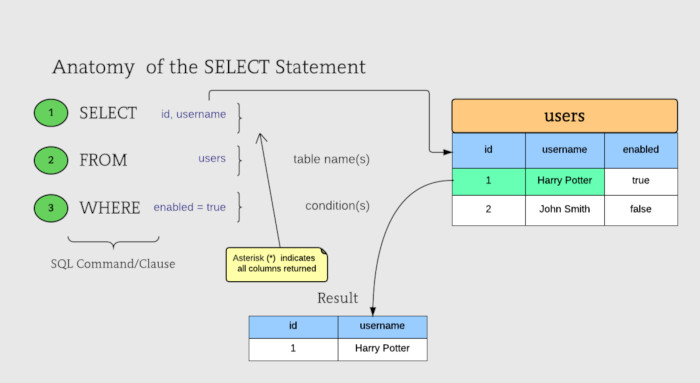

Οι λογικοί τελεστές που υποστηρίζονται είναι οι γνωστοί μας από την άλγεβρα Βool και τις γλώσσες προγραμματισμού και έχουν ως εξής:

**OR ή ||** : Λογικό Ή

**XOR** : Αποκλειστικό Ή

**AND ή &&** : Λογικό ΚΑΙ

**ΝΟΤ ή!** : Λογική άρνηση

Οι τελεστές σύγκρισης είναι οι: **<** , **>** , **<=** , **>=** , **=** , **<>** , **!=** , με τους δύο τελευταίους να είναι ίδιοι (υλοποιούν το διάφορο).

Οι αριθμητικές πράξεις που υποστηρίζονται είναι οι: **+** , **-** , * , **/** , **DIV** , **MOD** , **%,** με το DIV να είναι η ακέραια διαίρεση και τα MOD και % το υπόλοιπο της διαίρεσης ακεραίων.

Η MySQL υποστηρίζει επιπλέον τελεστές για χειρισμό τύπων και συγκρίσεις.

* **IS** και **IS NOT** : Ελέγχει την Boolean τιμή μιας έκφρασης. Οι Boolean τιμές είναι: TRUE, FALSE, UNKNOWN.  
* **IS NULL** και **IS NOT NULL** : Ελέγχει ανμία έκφραση είναι NULL ή όχι.  
* **ΒΕΤWEEN τιμή1 AND τιμή2** : Ελέγχει αν μία έκφραση είναι μεγαλύτερη ίση από τιμή1 και μικρότερη ίση από τιμή2.  
* **LIKE** και **NOT LIKE** : Ελέγχει αν ένα όρισμα ταιριάζει με κάποιο αλφαριθμητικό πρότυπο. 
Η σύγκριση γίνεται χαρακτήρα, χαρακτήρα και επομένως τα κενά στο τέλος παίζουν ρόλο. Στο πρότυπο μπορούν να χρησιμοποιηθούν τα εξής δύο wildcards: ο χαρακτήρας
_ που σημαίνει οποιοσδήποτε χαρακτήρας και ο χαρακτήρας % που σημαίνει
οποιαδήποτε σειρά χαρακτήρων.


Υποστηρίζεται, επίσης, μία πληθώρα τελεστών και συναρτήσεων όσον αφορά στο _χειρισμό αλφαριθμητικών_. Στη συνέχεια συνοψίζονται κάποιες από αυτές.

* **CHAR_LENGTH** (αλφαριθμητικό)
Επιστρέφει το πλήθος των χαρακτήρων του αλφαριθμητικού. 
Παράδειγμα:
```
SELECT CHAR_LENGTH('MySQL5.7');
```
Δίνει 8

* **UPPER** (αλφαριθμητικό).  
Μετατροπή σε κεφαλαία.  
Παράδειγμα:
```
SELECTUPPER('MySql5.7');
```
Δίνει MYSQL5.7

* **LOWER** (αλφαριθμητικό).
Μετατροπή σε πεζά.  
Παράδειγμα:
```
SELECTLOWER('MySql5.7');
```
Δίνει mysql5.7

* **CONCAT** (α1, α2, ..).
Συνενώνει τα αλφαριθμητικά α1, α2, κλπ.  
Παράδειγμα: 
```
SELECT CONCAT('My', 'SQL5.7');
```
Δίνει MySQL5.7

* **REPLACE** (a1,a2,a3).
Επιστρέφει το α1 μόνο που όπου υπάρχει το α2 αντικαθίσταται μετο α3.  
Παράδειγμα:  
```
SELECT REPLACE('MyQL5.7', 'QL', 'SQL');
```
Δίνει MySQL5.7

* **LOCATE** (a1,a2).
Επιστρέφειτη θέση μέσα στο α2 όπου εμφανίζεται το α1 για πρώτηφορά.
Παράδειγμα:
```
SELECT LOCATE('work', 'The working place where I work'); 
```
Δίνει 5

* **SUBSTR** ή **SUBSTRING** (αλφαριθμητικό, θέση, μέγεθος).
Επιστρέφει από το αλφαριθμητικό το υποαλφαριθμητικό που ξεκινά από την προσδιοριζόμενη θέση και είναι μήκους ίσο με το μέγεθος που δίνεται. Αν δε δίνεται το μέγεθος επιστρέφεται το υποαλφαριθμητικό από τη θέση και μέχρι το τέλος του αλφαριθμητικού.  
Παράδειγμα:  
```
SELECT SUBSTR('The working place where I work', 5, 4); 
```
Δίνει work


Πολύ σημαντική είναι η υποστήριξη μιας πληθώρας συναρτήσεων για _χειρισμό ημερομηνιών και χρόνου_. Στη συνέχεια συνοψίζονται κάποιες από αυτές.

* **NOW(), CURRENT_TIMESTAMP()**
Η NOW() επιστρέφει την τρέχουσα ημ/νία και ώρα (τύπος DATETIME). Ισοδύναμη με τη NOW() είναι η CURRENT_TIMESTAMP. Ως όρισμα στις συναρτήσεις αυτές μπορούμε να
περάσουμε την επιθυμητή ακρίβεια ως υποδιαίρεση του δευτερολέπτου. Η μέγιστη
δυνατή ακρίβεια είναι της τάξης του μsec και ως εκ τούτου μέγιστη τιμή στο όρισμα
μπορεί να είναι το 6. Αν δεν προσδιοριστεί η επιθυμητή ακρίβεια υπονοείται 0 δηλ.
ακρίβεια δευτερολέπτου.  

Παράδειγμα:
```
SELECT NOW(6);
```
Δίνει πχ. 2015-10-14 09:27:05.913871

* **DATE(), TIME(), DAY() ή DAYOFMONTH(), DAYOFYEAR(), DAYOFWEEK(),MONTH(), WEEK(), YEAR(), HOUR(), MINUTE(), SECOND(), MICROSECOND()**

Από έναν τύπο DATE ή DATETIME ή TIMESTAMP, εξάγει την πληροφορία που
περιγράφεταιαπό το όνομα της συνάρτησης.

Παράδειγμα:
```
SELECT MINUTE(NOW());
```
Αν η NOW() επέστρεφε το TIMESTAMP του προηγούμενου παραδείγματος δηλ. 2015-10-14 09:27:05 η εντολή θα επέστρεφε 27.

```
SELECT DATE(NOW());
```
Στο παράδειγμα επιστρέφει: 2015-10-14.

```
SELECT TIME(NOW());
```
Στο παράδειγμα επιστρέφει: 09:27:05.

```
SELECT DAYOFMONTH(NOW()),DAYOFYEAR(NOW()),DAYOFWEEK(NOW());
```
Στο παράδειγμα επιστρέφει μία εγγραφή με τρία πεδία: 14, 287, 4.

* **DAYNAME(),MONTHNAME()**
Επιστρέφουν το όνομα της ημέρας και του μήνα αντίστοιχα.

Παράδειγμα:
```
SELECT DAYNAME('2015-10-14 09:27:05'), MONTHNAME('2015-10-14 09:27:05');
```

Επιστρέφει μία εγγραφή με δύο πεδία: Wednesday, October.


* **ADDDATE** (όρισμα,INTERVALτιμή τύπος).  
Προσθέτει στο όρισμα το χρόνο πουκαθορίζεται από την τιμή και τον τύπο της τιμής.
Επιτρεπτοί τύποι τιμών είναι όλες οιυποδιαιρέσεις χρόνου στο εύρος από YEAR μέχρι MICROSECOND καθώς και συνδυασμοί των DAY, HOUR, MINUTE, SECOND, MICROSECOND, ανά δύο με πρώτη τη μεγαλύτερη μονάδα μέτρηση πχ. DAY_HOUR, DAY_MINUTEκλπ. Επίσης υποστηρίζεται και το YEAR_MONTH. Τέλος μπορούμε να παραλείψουμε τον τύπο και τη λέξη INTERVAL στην οποία περίπτωση προστίθενται
ημέρες.  

Παράδειγμα:
```
SELECT ADDDATE('2015-10-14', INTERVAL '2-3' YEAR_MONTH);
```
Επιστρέφει: 2018-01-14

```
SELECTADDDATE('2015-10-14 09:27:05.913871', 10);
```
Επιστρέφει: 2015-10-24 09:27:05.913871.

* **ADDTIME** (όρισμα, διάστημα).
Προσθέτει στο όρισμα το χρονικό διάστημα.

Παράδειγμα:
```
SELECTADDTIME('2015-10-14 09:27:05.999999', '0.000001');
```
Δίνει 2015-10-14 09:27:06.

```
SELECT ADDTIME('2015-10-14 09:27:05.999999', '1 0:1:2.000001');
```
Δίνει 2015-10-15 09:28:08.

```
SELECT ADDTIME('2015-10-14 09:27:05.9', '48:0:0');
```
Δίνει 2015-10-16 09:27:05.900000.

* **TIMESTAMPADD** (τύπος, τιμή, όρισμα).
Όμοια με την ADDDATE μόνο που δεν υποστηρίζει ζευγάρια τύπων και η τιμή είναι
αριθμός.

Παράδειγμα:
```
SELECT TIMESTAMPADD(SECOND, 1.5, '2015-10-14 09:27:05.913871');
```
Επιστρέφει: 2015-10-14 09:27:07.413871.

* **SUBDATE(),SUBTIME()**
Συμμετρικές των ADDDATE() και ADDTIME() μόνο που αφαιρούν χρόνο.

* **DATEDIFF** (όρισμα1, όρισμα2)
Επιστρέφει τη διαφορά σε ημέρες των δύο ορισμάτων (όρισμα1–όρισμα2).

Παράδειγμα:
```
SELECT DATEDIFF(ADDTIME('2015-10-14 09:27:05.913871', '1 20:0:0'), '2015-10-14 09:27:05.913871');
```
Επιστρέφει 2.

## **Συναρτήσεις συνάθροισης**

Όλες οι συναρτήσεις συνάθροισης χρησιμοποιούνται στο SELECT τμήμα ενός ερωτήματος. Παίρνουν ως όρισμα μία έκφραση και επιστρέφουν ως αποτέλεσμα μία τιμή. Η τιμή αυτή υπολογίζεται ως εξής: υπολογίζεται πρώτα η τιμή της έκφρασης για κάθε γραμμή του πίνακα και στη συνέχεια εφαρμόζεται η συνάρτηση που περιγράφεται για το σύνολο των τιμών που υπολογίστηκαν. Αν σε κάποια γραμμή η έκφραση αποτιμείται σε NULL, η συγκεκριμένη γραμμή δε μετέχει στον υπολογισμό.

Οι βασικές συναρτήσε ις συνάθροισης αριθμητικών τιμών στην SQL είναι οι εξής:

* **SUM(έκφραση)**: επιστρέφει το άθροισμα.  
* **AVG(έκφραση)**: επιστρέφει το μέσο όρο.  
* **MAX(έκφραση)**: επιστρέφει τη μέγιστη τιμή.  
* **MIN(έκφραση)**: επιστρέφει την ελάχιστη τιμή.  
* **STDDEV_POP(έκφραση)**: επιστρέφει την τυπική απόκλιση.  
* **COUNT(έκφραση)**: επιστρέφει το πλήθος γραμμών.  

_Παράδειγμα_:
Βρες το πλήθος των εγγραφών στον Customer για τις οποίες υπάρχουν διευθύνσεις.

```
SELECT COUNT(address) FROM Customer;
```

Επιστρέφει: 3

## **Απόκρυψη διπλότυπων εγγραφών (Distinct)**

Στο SELECT ενός ερωτήματος επιλέγουμε ένα ή περισσότερα πεδία για ναεμφανιστούν. Αν και σε πίνακες που έχει οριστεί PRIMARY KEY δεν υπάρχει περίπτωση να υπάρξουν δύο ίδιες εγγραφές, εντούτοις στα αποτελέσματα των ερωτημάτων μπορεί να έχωδιπλές εγγραφές. 
Αν αυτό δεν είναι επιθυμητό τότε μπορούμε να χρησιμοποιήσουμε την επιλογή **DISTINCT**.

```
SELECT name, sname FROM Customer;
```

Αν υπάρχουν δύο πελάτες με το ίδιο ον/μο επιστρέφεται μία εγγραφή για τον καθένα.

```
SELECT DISTINCT name, sname FROM Customer;
```

Οι διπλές εγγραφές κόβονται από το αποτέλεσμα.

## **Μετονομασία πεδίου (AS)**

Κάποιες φορές επιθυμούμε να αλλάξουμε το όνομα ενός πεδίου όπως αυτό εμφανίζεταιστο αποτέλεσμα ενός ερωτήματος. Μπορεί να επιτευχθεί αυτό βάζοντας μετά το πεδίο: **AS καινούργιο_όνομα**.

```
SELECT cid, CONCAT(name,' ', surname) FROM Customer;
```

Εμφανίζει έναν πίνακα με τις εξής δύο στήλες: cid και CONCAT(name,' ',surname).

```
SELECT cid, CONCAT (name,' ', surname) AS fullName FROM Customer;
```

Εμφανίζει τα ίδια αποτελέσματα με πριν σε έναν πίνακα με τις εξής δύο στήλες: cid και fullName.

## **Ταξινόμηση (Order By)**

Αν δώσουμε το ερώτημα:

```
SELECT name, cid, sname FROM Customer;
```

θα δούμε ότι τα αποτελέσματα επιστρέφονται σε αύξουσα σειρά ως προς cid. Γενικά μιλώντας τα αποτελέσματα ενός ερωτήματος επιστρέφονται σε αύξουσα σειρά ως προς το PRIMARY KEY. Αν επιθυμούμε να επιστρέψουμε τα αποτελέσματα με άλλη σειρά μπορούμε να το κάνουμε προσθέτοντας στο τέλος του ερωτήματος την επιλογή **ORDER BY**.

```
SELECT * FROM Customer WHERE TRUE ORDER BY sname ASC, dateOfBirth DESC;
```

Το ερώτημα θα εμφανίσει όλες τις εγγραφές του πίνακα Customer ταξινομημένες πρώτα ως προς αύξουσα σειρά επωνύμου (ASC από το ascending) και έπειτα (για τις εγγραφές με ίδιο επώνυμο) ταξινομημένες ως προς ημ/νια γέννησης σε φθίνουσα σειρά (DESC από το descending). Αν παραλείψουμε τους προσδιοριστές ASC/DESC το default είναι το ASC.

## **Επιλογή όλων (*)**

Αν επιθυμούμε να εμφανίσουμε όλα τα πεδία του πίνακα που προκύπτει από το FROM, αντί να τα αναφέρουμε στο SELECT ένα προς ένα, μπορούμε να χρησιμοποιήσουμε το *.

Παράδειγμα:

```
SELECT * FROM Customer;
```
Ισοδύναμο με το:

```
SELECT cid, afm, address, name, sname, dateOfBirth FROM Customer;
```

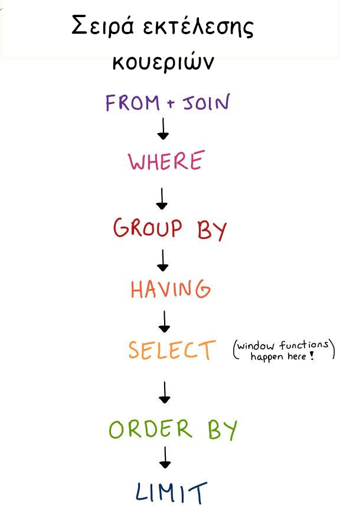

## **Βασικές πράξεις συνόλων**

Έστω ότι έχουμε δύο σύνολα τα R και S που έχουν ιδίου τύπου στοιχεία. Θεωρείστε την παρακάτω αναπαράσταση των συνόλων R και S (σε μορφή διαγραμμάτων Venn).

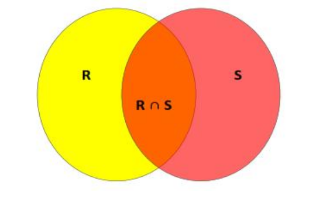

**Ένωση συνόλων**: Η πράξη της ένωσης συμβολίζεται με το U. Το αποτέλεσμά της R U S είναι ένα νέο σύνολο που περιέχει τόσο τα στοιχεία του R όσο και του S. Στο διάγραμμα Venn είναι όλη η χρωματισμένη περιοχή ανεξαρτήτως χρώματος.

**Τομή συνόλων**: Η πράξη της τομής συμβολίζεται με το∩.Το αποτέλεσμά της R ∩ S είναι ένα νέο σύνολο που περιέχει τα στοιχεία του R που είναι και στοιχεία του S, δηλ. τα κοινά στοιχεία των δύο συνόλων. Στο διάγραμμα Venn είναι η χρωματισμένη με πορτοκαλί περιοχή.

**Διαφορά συνόλων**: Η πράξη της διαφοράς συμβολίζεται με το -. Το αποτέλεσμά της R-S είναι ένα νέο σύνολο που περιέχει τα στοιχεία του R που δεν είναι στοιχεία του S, δηλ. τα στοιχεία του R που δεν ανήκουν στην τομή με το S. Στο διάγραμμα Venn είναι η χρωματισμένη μεκίτρινο περιοχή, ενώ η χρωματισμένη με κόκκινο αντιστοιχεί στο S-R.

Θεωρώντας τους πίνακες μιας σχεσιακής ΒΔ ως σύνολα εγγραφών, οι παραπάνω πράξεις βρίσκουν εφαρμογή κυρίως όποτε θέλουμε να συνδυάσουμε αποτελέσματα ερωτημάτων. Η υλοποίησή τους στην SQL γίνεται μέσω των εντολών UNION, INTERSECT και EXCEPT ή MINUS.
Η γενικότερη μορφή σύνταξης είναι:

```
ερώτημα 1  
UNION/INTERSECT/EXCEPT  
ερώτημα 2
```

_Παράδειγμα_
Βρες τους κωδικούς των πελατών που έχουν κινητό τηλέφωνο ή το όνομά τους είναι Maria.

Το ερώτημα εμπλέκει 2 πίνακες. Στην ουσία θέλουμε τα αποτελέσματα από 2 ερωτήματα αλλά θέλουμε να ισχύει τουλάχιστον μία από τις δύο συνθήκες, πράγμα που σημαίνει ότι θέλουμε την ένωση των 2 ερωτημάτων. Για οπτικούς λόγους βάζουμε τα δύο υποερωτήματα μέσα σε παρενθέσεις για να συμπτύξουμε τις γραμμές, αφού κάθε υποερώτημα είναι μικρό:

```
(SELECT cid FROM Customer WHERE name='Maria')  
UNION  
(SELECT cid FROM Phones WHERE pnum LIKE '6%');
```

**Προσοχή:** H MySQL στην έκδοση 5.7 δεν υποστηρίζει τις πράξεις INTERSECT και EXCEPT αλλά μόνο το UNION.

## **Καρτεσιανό γινόμενο**

Δοθέντος δύο συνόλων R και S που δεν έχουν απαραίτητα στοιχεία ιδίου τύπου, το καρτεσιανό γινόμενο των δύο συνόλων (RXS) ορίζεται σαν το σύνολο που αποτελείται από όλα τα ζευγάρια της μορφής (a, b) όπου το aανήκει στο R και το b στο S. Με άλλα λόγια είναι ένα σύνολο που περιέχει όλους τους συνδυασμούς στοιχείων του R με το S.

Το καρτεσιανό γινόμενο είναι η βασική πράξη συνδυασμού δύο η περισσοτέρων πινάκων σε ένα ερώτημα. Για να εφαρμόσουμε καρτεσιανό γινόμενο δύο πινάκων στο FROM του αντίστοιχου ερωτήματος μπορούμε ή να γράψουμε τα ονόματα των δύο πινάκων χωρισμένα με κόμμα ή να χρησιμοποιήσουμε την εντολή CROSS JOIN.

_Παράδειγμα_
Εμφάνισε το καρτεσιανό γινόμενο των πινάκων Customer και Phones.

**1ος τρόπος:** 
```
SELECT * FROM Customer, Phones;
```

**2ος τρόπος:** 
```
SELECT * FROM Customer CROSS JOIN Phones;
```

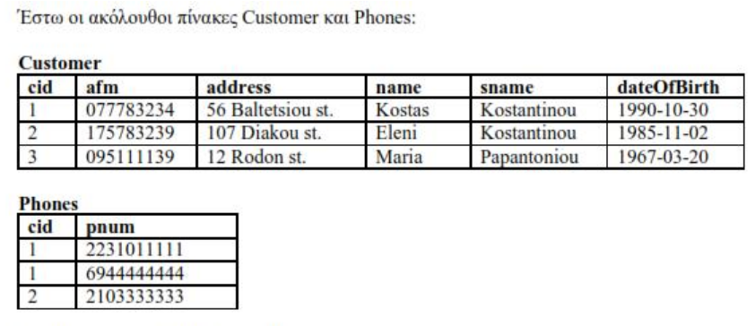

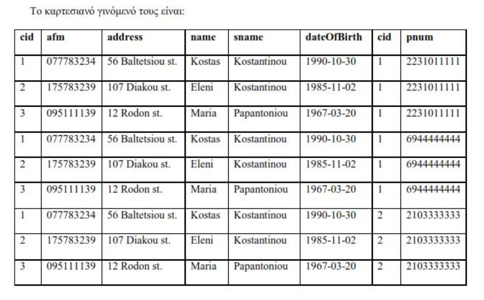


_Παρατηρήστε ότι_:
A) Οι εγγραφές του καρτεσιανού γινομένου είναι όλοι οι δυνατοί συνδυασμοί των εγγραφών των δύο πινάκων. Στη γενικότερη περίπτωση αν έχω στον πρώτο πίνακα Μ εγγραφές και στο δεύτερο Ν, στο καρτεσιανό θα υπάρχουν ΜΝ εγγραφές. Αυτό σημαίνει ότι ενδέχεται κάποιες εγγραφές που επιστρέφονται να είναι ίδιες.

B)Τα πεδία του καρτεσιανού γινομένου είναι τα πεδία και των δύο πινάκων. Σε περίπτωση που υπάρχουν κοινά πεδία στους δύο πίνακες (το cid στο παράδειγμα) εμφανίζονται δύο φορές στο αποτέλεσμα. Για να χρησιμοποιήσουμε κάποιο κοινό πεδίο στο ερώτημα θα πρέπει να αναφερθούμε συγκεκριμένα στον πίνακα από τον οποίο προέρχεται, γράφοντας το όνομα του πίνακα μαζί με του πεδίου χωρισμένα με τελεία.

## **Συνένωση**

Η πράξη του καρτεσιανού γινομένου δύο πινάκων Τ1 και Τ2 και ησυνακόλουθη εφαρμογή κριτηρίων στο WHERE, είναι τόσο συχνή που αναφερόμαστε ξεχωριστά σε αυτή ως συνένωση-θ (θ-join) των πινάκων Τ1 και Τ2. Θεωρήστε τους ακόλουθους πίνακες Customer και Phones:


Το παρακάτω ερώτημα:
```
SELECT afm  
FROM Customer, Phones  
WHERE Customer.cid=Phones.cid AND Phones.pnum LIKE '6%';
```

βρίσκει τα ΑΦΜ των πελατών που έχουν κινητά τηλέφωνα. Ο τρόπος σύνταξης του ερωτήματος υπονοεί ότι πρώτα θα γίνει το καρτεσιανό γινόμενο των δύο πινάκων και στη συνέχεια θα εφαρμοστούν τα κριτήρια του WHERE. Με άλλα λόγια πρώτα θα δημιουργηθούν οι 9 εγγραφές του καρτεσιανού και στη συνέχεια θα επιλεγούν αυτές που πληρούν το WHERE. Αντίθετα η χρήση της συνένωσης-θ στην παραπάνω περίπτωση θα υπονοούσε ότι δε χρειάζεται να παραχθεί πρώτα το καρτεσιανό γινόμενο αλλά το μέρος αυτού που πληροί τη συνθήκη Customer.cid=Phones.cid (3 εγγραφές) και στη συνέχεια οι εγγραφές αυτές θα ελέγχονταν ως προς τη συνθήκη Phones.pnum LIKE '6%'.

Η βασική δομή εντολής για να κάνουμε συνένωση δύο πινάκων είναι:

```
πίνακας1 [INNER | CROSS] JOIN πίνακας2 [join_συνθήκη]
```

όπου στη join_συνθήκη μπορούμε να έχουμε τις ακόλουθες δύο επιλογές:
* ON λογική_συνθήκη: κατά τα πρότυπα του WHERE.  
* USING (λίστα_πεδίων): ισότητα στα πεδία της λίστας με την προϋπόθεση να είναι κοινά και γιατουςδύο πίνακες.

Στη MySQL JOIN, INNER JOIN και CROSS JOIN είναι ισοδύναμα και πραγματοποιούν αυτό που ονομάζεται **εσωτερική συνένωση πινάκων**.

_Παραδείγματα_
Οι ακόλουθες queries βρίσκουν τα afm των πελατών που έχουν κινητό τηλέφωνο.

**(I) Με comma join**
```
SELECT afm  
FROM Customer, Phones  
WHERE Customer.cid=Phones.cid AND Phones.pnum LIKE '6%';
```

**(II) Με INNER JOIN.**
```
SELECT afm  
FROM Customer INNER JOIN Phones ON Customer.cid=Phones.cid  
WHERE Phones.pnum LIKE '6%';
```

**(III) Με JOIN (ισοδύναμο του INNER JOIN)**
```
SELECT afm  
FROM Customer JOIN Phones ON Customer.cid=Phones.cid  
WHERE Phones.pnum LIKE '6%';
```

**(IV) Με CROSS JOIN**
```
SELECT afm  
FROM Customer CROSS JOIN Phones ON Customer.cid=Phones.cid  
WHERE Phones.pnum LIKE '6%';
```

**(V) INNER JOIN χρησιμοποιώντας το USING αντί του ON.**
```
SELECT afm  
FROM Customer INNER JOIN Phones USING (cid)  
WHERE Phones.pnum LIKE '6%';
```

**(VI) Ισοδύναμη με την (Ι)**
```
SELECT afm  
FROM Customer CROSS JOIN Phones  
WHERE Customer.cid=Phones.cid AND Phones.pnum LIKE '6%';
```

**(VII) INNER JOIN χωρίς WHERE**
```
SELECT afm  
FROM  
Customer INNER JOIN Phones ON  
Customer.cid=Phones.cid AND Phones.pnum LIKE '6%';
```

## **Εξωτερικές συνενώσεις**

Ας υποθέσουμε ότι στο Phones δεν είχαμε ορίσει ως ξένο κλειδί το cid και είχαμε το ακόλουθο στιγμιότυπο για τους πίνακες Customer και Phones:

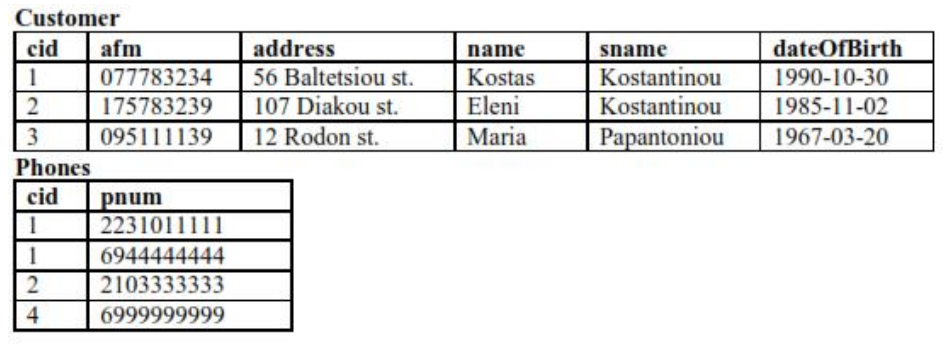


Έστω ότι θέλουμε να εμφανίσουμε τα στοιχεία των πελατών μαζί με τα τηλέφωνά τους (αν έχουν). Το ερώτημα δεν μπορεί να απαντηθεί χρησιμοποιώντας εσωτερική συνένωση καθώς με αυτό τον τρόπο δε θα επιστραφούν τα στοιχεία του πελάτη με cid=3 καθώς δε συνδυάζεται με καμία από τις εγγραφές στοPhones. Κάτι αντίστοιχο θα προέκυπτε εάν ζητούσαμε τα τηλέφωνα μαζί με στοιχεία για τους πελάτες που ανήκουν (αν υπάρχουν ιδιοκτήτες). Για να απαντηθούν τέτοια ερωτήματα χρησιμοποιούνται εξωτερικές συνενώσεις. Στην SQL περιγράφονται τριών ειδών εξωτερικές συνενώσεις: αριστερή (LEFT), δεξιά (RIGHT) και πλήρης (FULL). Η σύνταξη είναι αντίστοιχη της εσωτερικής συνένωσης:

```
πίνακας1 {LEFT | RIGHT | FULL} [OUTER] JOIN πίνακας2 join_συνθήκη
```

Η αναγραφή του OUTER είναι προαιρετική και στην πράξη πολλές φορές παραλείπεται.
Οι κανόνες για ταONκαιUSINGόσον αφορά τις επιστρεφόμενες στήλες είναι.

_Παραδείγματα_

### **LEFT JOIN**

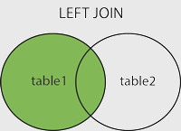

Επιστρέφει όλες τις εγγραφές από τον αριστερό πίνακα και τις αντίστοιχες εγγραφές από τον δεξιό πίνακα.

i. 
```
SELECT * FROM Customer LEFT JOIN Phones ON Customer.cid=Phones.cid;
```
Επιστρέφει:

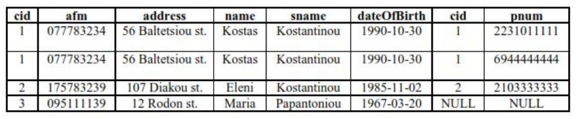

Όπως παρατηρούμε η εγγραφή με cid=3 του πίνακα Customer που δε συνδυάζεται με καμία εγγραφή από τον πίνακα Phones βρίσκεται στο αποτέλεσμα του LEFT JOIN, με NULL στα πεδία του Phones.

ii.
```
SELECT * FROM Customer LEFT JOIN Phones USING(cid);
```
Επιστρέφει:
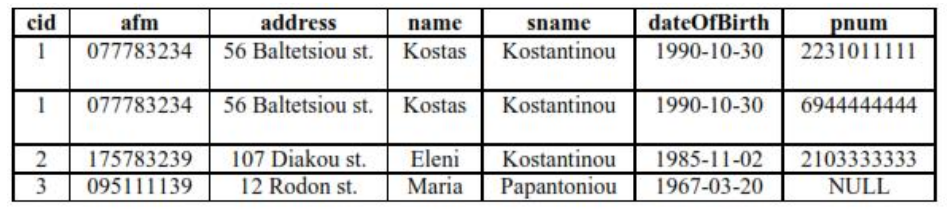


## **RIGHT JOIN**

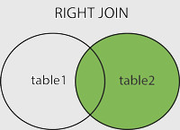

Επιστρέφει όλες τις εγγραφές από το δεξί πίνακα και τις αντίστοιχες εγγραφές από τον αριστερό πίνακα.

i. 
```
SELECT * FROM Customer RIGHT JOIN Phones ON Customer.cid=Phones.cid;
```
Επιστρέφει:

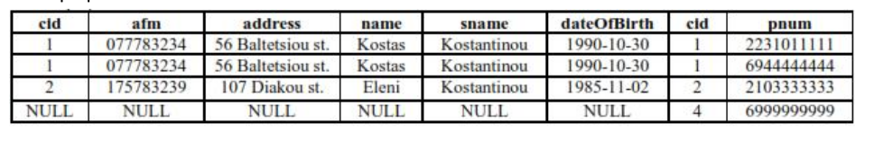

ii. 
```
SELECT * FROM Customer RIGHT JOIN Phones USING(cid);
```
Επιστρέφει:

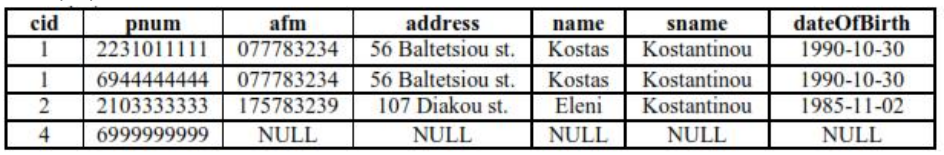

## **FULL JOIN**

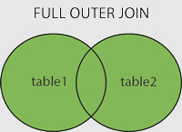

Επιστρέφει εγγραφές που έχουν αντίστοιχες τιμές και στους δύο πίνακες.

i. 
```
SELECT * FROM Customer FULL JOIN Phones ON Customer.cid=Phones.cid;
```
Επιστρέφει:

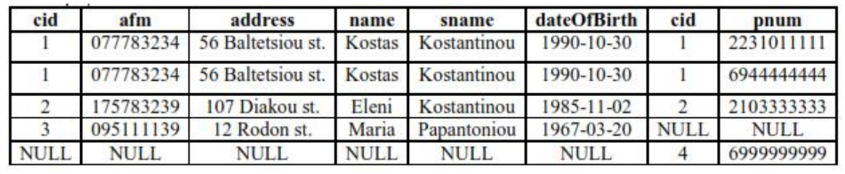

Παρατηρούμε ότι τόσο οι εγγραφές του Customer που δε συνδυάζονται, όσο και οι αντίστοιχες εγγραφές του Phones εμφανίζονται στο αποτέλεσμα με NULL στα πεδία του άλλου πίνακα.

ii. 
```
SELECT * FROM Customer FULL JOIN Phones USING(cid);
```
Επιστρέφει:

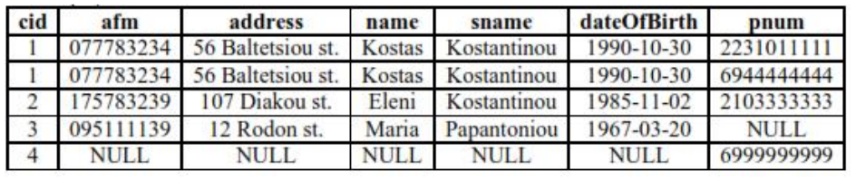

# ΟΠΤΙΚΗ ΑΝΑΠΑΡΑΣΤΑΣΗ JOIN 

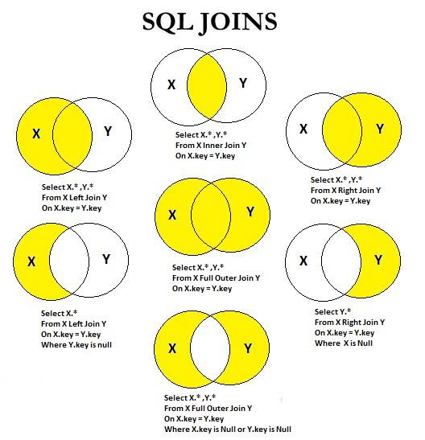  


# ΚΑΝΟΝΙΚΟΠΟΙΗΣΗ

## 1NF

Ένας πίνακας λέμε ότι βρίσκεται σε 1NF, όταν η τιμή του κάθε πεδίου σε κάθε πλειάδα, είναι *ατομική* δηλαδή δεν μπορεί να διασπαστεί σε μικρότερες μονάδες πληροφορίας.  

Αποτρέπει την εμφάνιση **επαναλαμβανόμενων πεδίων** και την εμφάνιση **σύνθετων** ή **πολλαπλών** τιμών καθώς και **συνδυασμούς αυτών** των δύο.

### Απαιτήσεις 1ΝF :
* Όλες οι πλειάδες πρέπει να προσδιορίζονται μοναδικά με ένα πρωτεύον κλειδί. Το πρωτεύον κλειδί είναι μοναδικό για την κάθε πλειάδα (εγγραφή/καταχώρηση).  
* Όλα τα πεδία, πέραν του πρωτεύοντος κλειδιού, πρέπει να εξαρτώνται από αυτό.  
* Όλα τα πεδία πρέπει να περιέχουν μια απλή τιμή.  
* Όλες οι τιμές στο ίδιο πεδίο πρέπει να είναι του ίδιου τύπου δεδομένων – datatype.  

*Η 1NF δημιουργεί συσχετίσεις πολλαπλότητας 1:Ν*

## 2NF

Ένας πίνακας λέμε ότι βρίσκεται σε 2NF, όταν όλα τα πεδία που δεν ανήκουν στο πρωτεύον κλειδί του πίνακα, εξαρτώνται συναρτησιακώς *μόνο* από τα πεδία του πρωτεύοντος κλειδιού, και μάλιστα, μέσω *πλήρους* συναρτησιακής εξάρτησης (**full** dependency).  

Η 2NF προκύπτει από την 1NF, εάν μετασχηματίσουμε τη δομή του πίνακα, ώστε να απομακρυνθούν όλες οι μερικές συναρτησιακές εξαρτήσεις (partial dependencies) που υφίστανται ανάμεσα στα πεδία του.  

**H αναγωγή ενός πίνακα στη 2NF έχει νόημα μόνο όταν το πρωτεύον κλειδί του είναι σύνθετο**

**ΑΛΛΟΣ ΟΡΙΣΜΟΣ**: Ένας πίνακας R είναι σε 2NF αν και μόνο αν είναι σε 1NF και **κάθε πεδίο του που δεν ανήκει σε κλειδί δεν εξαρτάται από υποσύνολο κάποιου υποψήφιου κλειδιού**.  

### Απαιτήσεις 2ΝF:
* Ο πίνακας πρέπει να είναι στην 1NF.  
* Πρέπει να εξαλειφθούν τα πεδία που είναι μερικώς εξαρτημένα ή ανεξάρτητα από το πρωτεύον κλειδί.  
* Πρέπει να δημιουργηθούν νέοι πίνακες με τα με τα πεδία που μερικώς εξαρτημένα ή ανεξάρτητα από το πρωτεύον κλειδί.  

- H 2NF κάνει το αντίστοιχο της 1NF, όχι όμως στα πεδία, αλλά στις τιμές  
- Η 2NF δημιουργεί συσχετίσεις πολλαπλότητας Ν:1  

## 3NF

Ένας πίνακας λέμε ότι βρίσκεται σε 3NF, όταν δεν υφίστανται **μεταβατικές εξαρτήσεις (transitive dependencies)** μεταξύ των πεδίων του.  

Αν υπάρχουν μεταβατικές εξαρτήσεις, αυτές πρέπει να εξαλειφθούν και να δημιουργηθούν νέοι πίνακες με τα με τα πεδία που δημιουργούν μεταβατικές εξαρτήσεις.  

Η 3NF επιβάλλει ο πίνακας να είναι 2NF και όλα τα πεδία που δεν είναι ξένα κλειδιά να είναι πλήρως εξαρτημένα **μόνο** από το πρωτεύον κλειδί

**ΑΛΛΟΣ ΟΡΙΣΜΟΣ**: Ένας πίνακας R είναι σε 3NF αν είναι σε 2NF και **κάθε πεδίο που δεν ανήκει σε κλειδί δεν εξαρτάται από πεδίο που δεν ανήκει σε κλειδί**.  

## Boyce-Codd Normal Form

**Ορίζον πεδίο (determinant)**: οποιοδήποτε πεδίο (απλό ή σύνθετο) μιας σχέσης από το οποίο κάποιο άλλο είναι πλήρως εξαρτημένο.

**Μια σχέση είναι στη BCNF αν και μόνο αν κάθε ορίζον πεδίο είναι υποψήφιο κλειδί**

Η κανονική μορφή των **Boyce και Codd** αποτελεί μια πιο αυστηρή διατύπωση της 3NF.

Χρησιμοποιείται για να απομακρύνει ανωμαλίες που ενδέχεται να προκύψουν σε περιπτώσεις που ένας πίνακας έχει περισσότερα από ένα υποψήφια κλειδιά, τα οποία μάλιστα είναι σύνθετα.

Ένας μη-BCNF πίνακας **δεν μπορεί πάντα** να αναλυθεί σε πίνακες BCNF π.χ. όταν **{A,B → C, C → B}, αντίθετα από τις τρεις πρώτες κανονικές μορφές**.

## 4NF

**Για ένα πίνακα σε 3NF/BCNF**, να απομακρύνουμε τις μη-τετριμμένες πλειότιμες συναρτησιακές εξαρτήσεις (multivalued dependencies). 

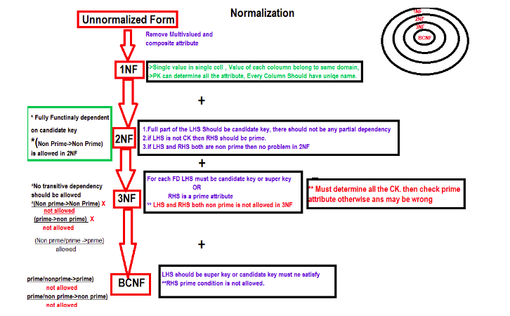
