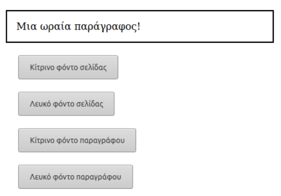

# Αλλαγή χρώματος με το πάτημα του κουμπιού

Ξεκινήστε από το δοθέν αρχείο ex.html και κατασκευάστε το αρχείο ex.js που θα υλοποιεί την λειτουργικότητα που φαίνεται δίπλα:

Hint:
Κάθε element object έχει το property style που, με τη σειρά του, έχει ως properties όλα τα CSS properties σε μορφή camelCasing. 

Παράδειγμα:
document.body.style.fontSize Επαυξήστε με περισσότερα πλήκτρα ή elements, αλλάζοντας περαιτέρω την αισθητική και λειτουργικότητα.

